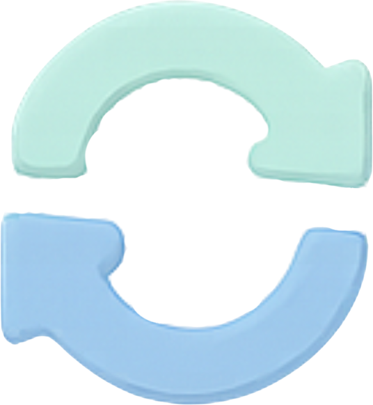
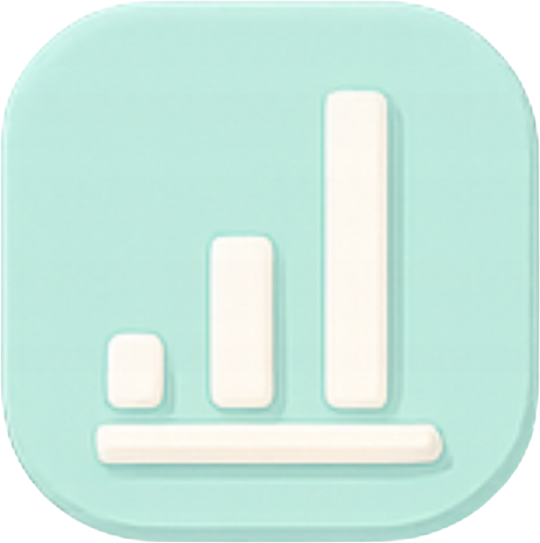
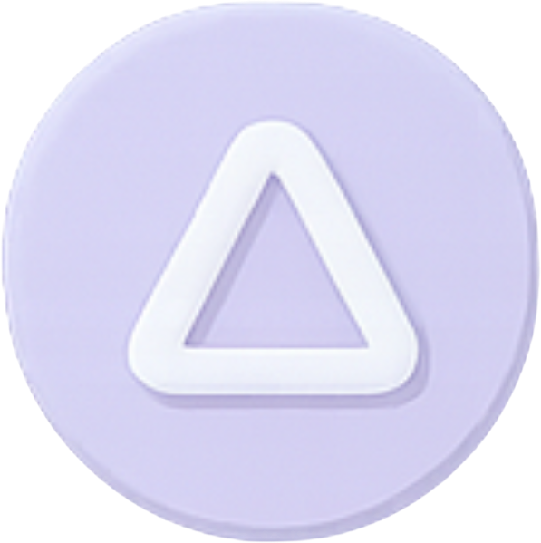
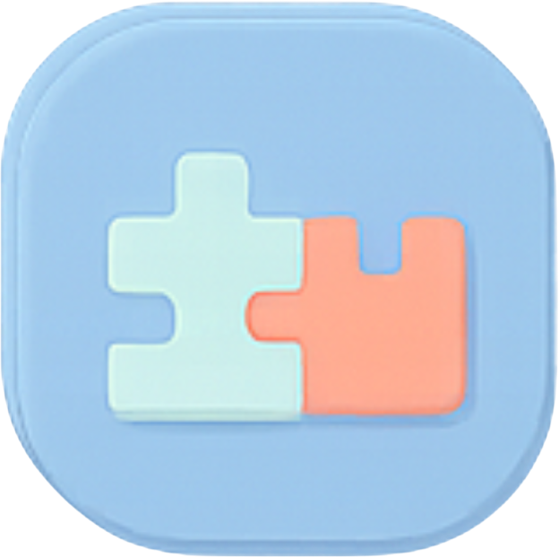
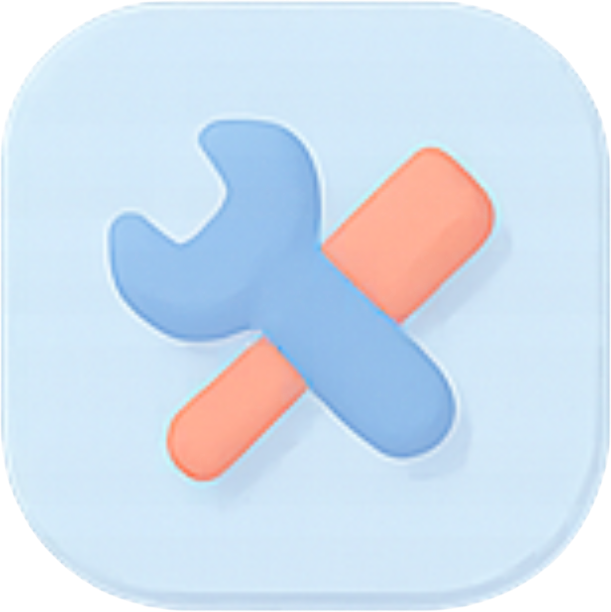

---
hide:
  - navigation
  - toc
---

# Welcome to the Nubra API FAQs

<!-- ============================= -->
<!-- FAQ SEARCH BAR (WORKING)     -->
<!-- ============================= -->

This FAQ section gives you quick, accurate answers to the most common questions asked by developers, quantitative researchers, and trading teams integrating with Nubra’s API ecosystem.

Whether you're authenticating via OTP/TOTP, switching between UAT and LIVE, handling market data streams, or debugging REST/Python SDK responses — you’ll find concise, practical guidance here.

If you’re new to Nubra APIs, you may want to explore the full documentation:  
[https://nubra.io/products/api/docs](https://nubra.io/products/api/docs)

<!-- NEW: Search bar moved below documentation link -->
<input
  type="text"
  id="faq-search"
  placeholder="Search FAQs..."
  class="faq-search-input"
/>

<ul id="faq-results-list" style="display:none; margin: 0; padding-left: 1rem;"></ul>

---

# Getting Started & Core Concepts

<a class="faq-card horizontal" href="general/">
  
  

    <h3>General</h3>
    
Basic concepts, onboarding, and introduction to the Nubra API ecosystem.

  

</a>

<a class="faq-card horizontal" href="authentication/">
  
  

    <h3>Authentication & Login</h3>
    
OTP, TOTP, token lifecycle, session handling, and login issues.

  

</a>

<a class="faq-card horizontal" href="uat_live/">
  
  

    <h3>UAT & LIVE Environments</h3>
    
Differences, testing flows, credentials, and when to switch.

  

</a>

<a class="faq-card horizontal" href="instruments/">
  
  

    <h3>Instruments & Reference Data</h3>
    
ref_ids, master download, expiries, and contract format rules.

  

</a>

<a class="faq-card horizontal" href="rate_limits/">
  
  

    <h3>Rate Limits & API Usage</h3>
    
REST/WebSocket caps, throttling behavior, and best practices.

  

</a>

---

# Market Data & Trading

<a class="faq-card horizontal" href="market_data/">
  
  

    <h3>Market Data & WebSocket</h3>
    
Snapshot vs streaming, tick frequency, depth, and subscriptions.

  

</a>

<a class="faq-card horizontal" href="historical/">
  
  

    <h3>Historical Data & Analytics</h3>
    
Intervals, corporate actions, adjustments, gaps, candle logic.

  

</a>

<a class="faq-card horizontal" href="orders/">
  
  

    <h3>Orders & Execution</h3>
    
Order types, flexi & basket orders, modify/cancel, common errors.

  

</a>

<a class="faq-card horizontal" href="margins/">
  
  

    <h3>Margins & Risk</h3>
    
Margin checks, aggressor limits, live updates, and risk rules.

  

</a>

<a class="faq-card horizontal" href="positions/">
  
  

    <h3>Positions & Holdings</h3>
    
Day vs net, conversions, holding logic, and reconciliation.

  

</a>

<a class="faq-card horizontal" href="greeks/">
  
  

    <h3>Options Greeks & Strategy APIs</h3>
    
Real-time Greeks, IV/Delta strategies, multi-leg logic.

  

</a>

---

# Integrations & Troubleshooting

<a class="faq-card horizontal" href="integrations/">
  
  

    <h3>Integrations & Tools</h3>
    
Excel, TradingView, Postman, backtesting, platform support.

  

</a>

<a class="faq-card horizontal" href="algo/">
  
  

    <h3>Algo Registration & Compliance</h3>
    
SEBI guidelines, registration workflow, approvals, documentation.

  

</a>

<a class="faq-card horizontal" href="troubleshooting/">
  
  

    <h3>Troubleshooting & Errors</h3>
    
Error decoding, debugging steps, rejection reasons, fixes.

  

</a>

---

## Can’t Find the Answer You’re Looking For?

We’re always here to help.  
Our support team typically responds quickly with detailed technical guidance.

[Need more assistance?](mailto:support@nubra.io){ .md-button .md-button--primary }

---

<!-- ============================= -->
<!-- FAQ SEARCH JS (WORKING)       -->
<!-- ============================= -->
