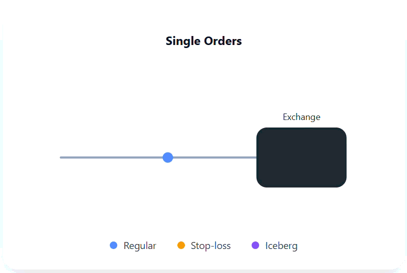

---
hide:
  - toc
  - navigation
---

# Place Multi Order — Execute Multiple Orders in One Request

The **Multi Order API** lets you submit **multiple independent orders using a single API request**.  
This reduces the number of outbound API calls you need to make, especially for basket trades or multi-leg strategies.

⚠️ **Important:**  
Multi Order does *not* merge execution.  
Each order is still **routed, evaluated, and filled independently** at the exchange.

---

# Single Order vs Multi Order (Basket)

<div class="mo-guide">
<div class="mo-compare-container">

  <!-- LEFT COLUMN: SINGLE ORDERS -->
  <div class="mo-column">
    <h3 class="mo-title"><strong>Single Orders</strong></h3>

    <div class="explain-box info">
      Orders are placed <strong>individually</strong>.  
      Each request is its <strong>own API call</strong> with separate  
      routing and acknowledgement.
    </div>

    <div class="mo-gif-wrap">
      <figure class="gif-card">
        
      </figure>
    </div>

    <ul class="mo-points">
      <li>One API request per order</li>
      <li>Each order is routed independently</li>
      <li>Good for occasional trades</li>
      <li>More network overhead for multi-leg strategies</li>
    </ul>
  </div>

  <div class="mo-divider"></div>

  <!-- RIGHT COLUMN: MULTI ORDER -->
  <div class="mo-column">
    <h3 class="mo-title"><strong>Multi Order (Basket)</strong></h3>

    <div class="explain-box tip">
      Multi Order lets you send <strong>multiple full order objects</strong>  
      inside a single API request.  
      This groups the submission — but each order is still  
      <strong>executed independently</strong> by the exchange.
    </div>

    <div class="mo-gif-wrap">
      <figure class="gif-card">
        
      </figure>
    </div>

    <ul class="mo-points">
      <li>All orders submitted in one API request</li>
      <li>Simplifies basket or multi-leg submission</li>
      <li>Reduces outbound requests (not exchange latency)</li>
      <li>Each order behaves like a normal standalone order</li>
    </ul>
  </div>

</div>
</div>

---

# How Multi Order Works

- You pass an **array of independent order objects**  
- Nubra sends them in **one API request**  
- The exchange still evaluates each order separately  
- The response returns **one result per order**, plus basket metadata  

This is submission-level grouping — not execution grouping.

---

# Multi Order — Example

```python
from nubra_python_sdk.start_sdk import InitNubraSdk, NubraEnv
from nubra_python_sdk.marketdata.market_data import MarketData
from nubra_python_sdk.trading.trading_data import NubraTrader

# 1. Initialize Nubra SDK
nubra = InitNubraSdk(NubraEnv.UAT)

# 2. Fetch Market Quote (used for both orders)
md = MarketData(nubra)

REF_ID = 1842210  # Common instrument for both legs
quote = md.quote(ref_id=REF_ID, levels=5)
ltp = quote.orderBook.last_traded_price
print(f"LTP: {ltp}")

# 3. Create Multi Order (Basket)
trade = NubraTrader(nubra, version="V2")

TOTAL_QTY = 1000       # Iceberg total quantity
LEG_SIZE = 100         # Visible quantity per iceberg leg
STOPLOSS_QTY = 50      # Stop-loss order quantity

result = trade.multi_order([
    {
        "ref_id": REF_ID,
        "order_type": "ORDER_TYPE_STOPLOSS",
        "order_qty": STOPLOSS_QTY,
        "order_side": "ORDER_SIDE_BUY",
        "order_delivery_type": "ORDER_DELIVERY_TYPE_IDAY",
        "validity_type": "DAY",
        "price_type": "LIMIT",
        "order_price": ltp + 50,
        "exchange": "NSE",
        "tag": "stoploss_leg",
        "algo_params": {
            "trigger_price": ltp + 30
        }
    },

    {
        "ref_id": REF_ID,
        "order_type": "ORDER_TYPE_ICEBERG",
        "order_qty": TOTAL_QTY,
        "order_side": "ORDER_SIDE_BUY",
        "order_delivery_type": "ORDER_DELIVERY_TYPE_CNC",
        "validity_type": "DAY",
        "price_type": "LIMIT",
        "order_price": ltp + 10,
        "exchange": "NSE",
        "tag": "iceberg_leg",
        "algo_params": {
            "leg_size": LEG_SIZE
        }
    }
])

print("Multi Order Response:")
print(result)
```