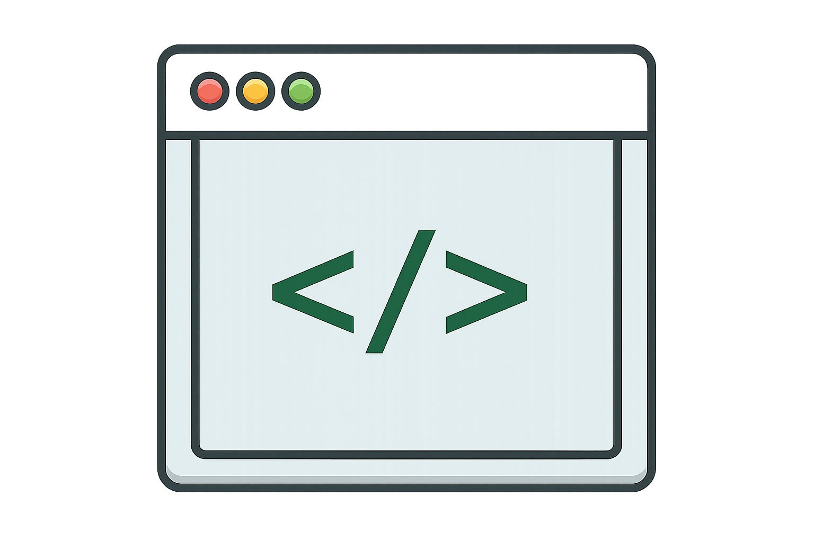

---
hide:
  - navigation
  - toc
---

# Nubra API Documentation

Nubra API is a modern, high-performance trading interface that enables seamless programmatic access to Nubra’s core trading infrastructure. It is designed for developers, quantitative traders, and institutions who require secure, reliable, and low-latency access to market data and order execution.

The API stack offers two integration options:

- **Python SDK** — A simplified, high-level SDK ideal for automation, strategy development, and rapid prototyping.
- **REST API** — A language-agnostic HTTP interface for enterprise-grade trading systems, custom tools, and backend integrations.

Both interfaces provide access to orders, positions, holdings, funds, and real-time market data with strong authentication and session-management controls.

> **Looking for help?**  
> Our Nubra AI Assistant is available at the bottom-right corner.  
> Use it to generate code, debug API calls, and accelerate your integration.
---

## Available APIs

<!-- PYTHON SDK -->
<a href="python-sdk/index.html" class="api-card">
  
API

  <h3>
    
    Python SDK
  </h3>
  

    High-level, streamlined SDK built for automation, rapid strategy development, 
    and simplified integration with Nubra’s trading systems.
  

  
View Python SDK Docs →

</a>

<!-- REST API -->
<a href="rest-api/index.html" class="api-card">
  
API

  <h3>
    
    REST API
  </h3>
  

    Language-agnostic REST endpoints designed for enterprise-grade trading systems, 
    backend applications, and custom execution engines.
  

  
View REST API Docs →

</a>

---

## Support

<!-- FAQs -->

<a href="faq/index.html" class="api-card">
  
HELP

  <h3>
    
    FAQs
  </h3>
  

    Find answers to common questions about authentication, market data, orders, 
    UAT vs LIVE, WebSockets, errors, margins, Greeks, algo registration, and more.
  

  
Browse FAQs →

</a>

<!-- Example Code -->
<a href="guides/index.html" class="api-card">
  
GUIDES

  <h3>
    
    Example Code
  </h3>
  

    Practical code examples for real-world API usage, covering orders, market data, Greeks, positions, and end-to-end automation flows.
  

  
View Code Examples →

</a>

