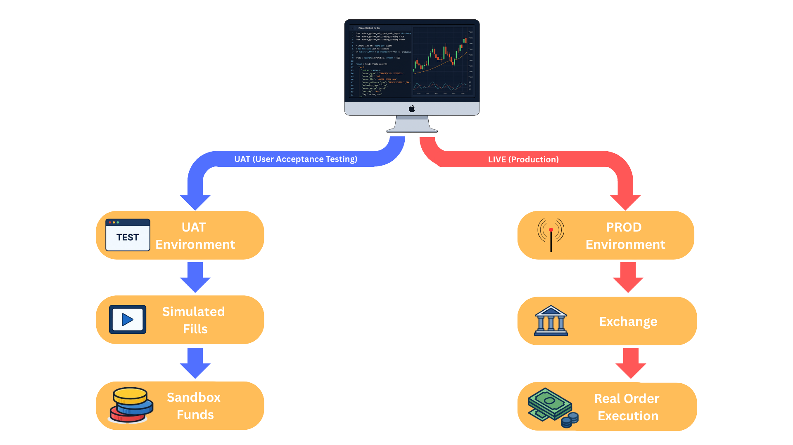

# UAT Environment

Nubra provides two environments for REST API development — **UAT** and **LIVE**.  
UAT allows you to test your REST integration safely without triggering real trades or affecting your live trading account.



---

## What is UAT?

The **UAT (User Acceptance Testing) environment** is a dedicated sandbox used for:

- Testing REST API authentication flows  
- Validating order placement, modification, and cancellation  
- Integrating backend systems with no financial risk  
- Verifying API logic before going LIVE  

UAT is completely isolated from LIVE and does **not** send orders to the exchange.

---

## UAT vs LIVE — Quick Difference Table

| Feature / Behavior               | UAT Environment                            | LIVE Environment                        |
|----------------------------------|---------------------------------------------|------------------------------------------|
| Execution Type                   | Simulated fills                             | Real exchange execution                  |
| Funds                            | Sandbox (virtual)                           | Actual trading balance                   |
| Market Impact                    | None                                        | Real orders, real impact                 |
| ref_id Values                    | Different from LIVE                         | Actual production ref_ids                |
| REST Endpoints                   | Same as LIVE                                | Same as UAT                              |
| Risk Level                       | Zero risk                                   | Real financial risk                      |
| Use Case                         | API development & testing                   | Actual trading integrations              |

---

## How UAT Works

- Orders return **simulated execution responses**  
- **Sandbox funds** are used instead of real capital  
- ref_id values differ between environments  
- Market data may differ slightly from LIVE  
- Perfect for integration testing, algo testing, and verification  

---

## Important Notes for Developers

- **ref_id values are different between UAT and LIVE**  
  Always fetch instruments from the correct environment before placing orders.

- **REST endpoints remain identical**  
  Only the *base URL* changes; all APIs function the same.

- **No real money is used in UAT**  
  You can test entire trading workflows with zero financial risk.

---

## Switching Between UAT and LIVE in REST API

Only the **base URL** changes:

### **UAT**
```
https://uatapi.nubra.io
```

### **LIVE**
```
https://api.nubra.io
```

Example: **Get Instruments**

#### UAT
```bash
curl --location 'https://uatapi.nubra.io/refdata/refdata/2025-06-27?exchange=NSE' \
--header 'x-device-id: TS123' \
--header 'Authorization: Bearer <token>'
```

#### LIVE
```bash
curl --location 'https://api.nubra.io/refdata/refdata/2025-06-27?exchange=NSE' \
--header 'x-device-id: TS123' \
--header 'Authorization: Bearer <token>'
```

---

## When Should You Use UAT?

Use UAT when you want to:

- Test REST API integration  
- Validate order placement, modification, cancellation  
- Test error handling & retry logic  
- Verify backend automation logic  
- Ensure your system behaves correctly before going LIVE  

Once your integration works flawlessly in UAT, switching to LIVE only requires changing the base URL.
