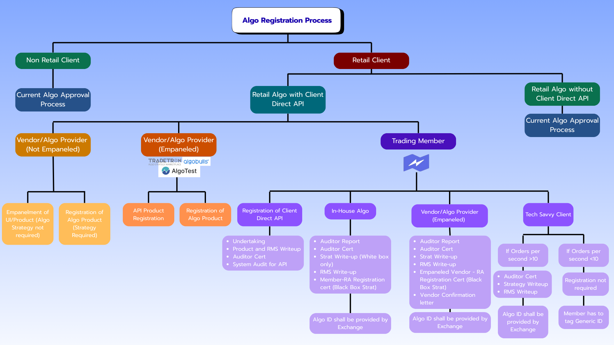

 
*A Practical Guide for Brokers, Fintechs, and Algo Traders*

Algorithmic trading in India has entered a **formal regulatory phase**.  
With the rollout of SEBI’s retail algo framework and exchange implementation standards, **API-based trading is no longer just a technical integration — it is a regulated activity**.

This guide distills the **most operationally relevant rules** around API trading, algo approvals, OPS limits, tagging, and broker responsibilities.

---

## Algo Registration Process (High-Level Flow)

> **Key Idea**  
> If a retail order is automated **and** sent via API, it is treated as an **algorithmic order** and must follow this framework.

---

## Why SEBI Regulated API-Based Trading

SEBI observed that:

- Retail traders increasingly used APIs and automation  
- Algo activity occurred **without uniform disclosure**
- Risk controls varied significantly across brokers and platforms  

To address this, SEBI mandated that:

> **All API orders are treated as algorithmic orders**  
> **Algo strategies must be classified, registered, and monitored**  
> **Brokers remain fully responsible for client orders**

---

## White Box vs Black Box Algos

Retail algos are categorised as White Box or Black Box depending on whether the trading logic is disclosed and replicable.

### 🟦 White Box Algos
*Logic is disclosed and replicable*

**Examples**
- TWAP
- VWAP
- Execution-only strategies

**Mandatory Requirements**
- Strategy write-up
- RMS explanation
- Auditor certificate

### 🟥 Black Box Algos
*Logic is not disclosed and not replicable*

**Examples**
- Arbitrage strategies
- Alpha-seeking models
- High-frequency scalping

**Additional Mandatory Requirements**
- Research Analyst (RA) registration
- Detailed research report
- **Any logic change → Fresh registration**

---

## Key Regulatory Takeaways (What Really Changed)

<h4>Open APIs Are Effectively Banned</h4>

Generic or shared API access is no longer permitted.
All API calls must use <strong>unique client–vendor keys</strong> and
<strong>whitelisted static IPs</strong>.

<h4>Brokers Are the Principal Party</h4>

Regardless of who builds or hosts the algo,
<strong>the broker owns full responsibility</strong>.

<h4>Mandatory Kill Switch</h4>

Exchanges can <strong>unilaterally disable any Algo ID</strong>.
Correct Algo ID tagging is <strong>mission critical</strong>.

<h4>Daily API Logout & 2FA</h4>

API sessions must be logged out <strong>daily</strong> and
re-authenticated with <strong>2FA</strong>.

<h4>Static IP Rules Are Strict</h4>

Each client must use a <strong>dedicated static IP</strong>.
Shared office or VPS IPs are not allowed.

<h4>OPS ≤ 10 Is Not a Free Pass</h4>

≤10 OPS applies only to tech-savvy retail clients.
Orders remain algo orders and must be monitored.

<h4>Vendors Never Own Algo IDs</h4>

Algo IDs are issued <strong>member-wise by the exchange</strong>.
The broker remains the <strong>single point of control</strong>.

---

## Who Is an Algo Provider (and How Retail Clients Differ)?

An **Algo Provider** includes:

- Fintech vendors  
- OMS / EMS providers  
- Platforms offering automated trading or execution via APIs  

> ⚠️ SEBI does not regulate algo providers directly  
> ✅ Exchanges mandate **empanelment**

Only **empanelled providers** are allowed to work with brokers.

A **Retail Client** includes individuals using **Client Direct APIs**, including **tech-savvy retail traders** running their own automation.

- **OPS ≤ 10** → Treated as algo orders but **registration exempt** (tech-savvy retail only; generic Algo ID required)  
- **OPS > 10** → **Exchange registration mandatory** with a unique Algo ID  

All automated API orders remain **algorithmic orders** and are monitored by the broker.

---

## How Nubra Can Help You Navigate SEBI Compliance

As a **SEBI-registered broker**, Nubra directly enables compliant API-based and algorithmic trading for retail traders, algo providers, and fintech platforms under the retail algo framework.

Nubra acts as the **single point of control** for registration, execution, risk management, and exchange compliance.

### Retail Traders (Including Tech-Savvy Retail)

You should reach out to Nubra if:

- You are using APIs for automated trading  
- You plan to run strategies close to or above **OPS ≤ 10**  
- You need clarity on:
  - Whether your strategy is **White Box or Black Box**
  - When **registration becomes mandatory**
  - How **Algo ID tagging** and **generic Algo IDs** work  
- You want to avoid accidental violations such as:
  - OPS breaches  
  - Static IP misuse  
  - Non-compliant API usage  

**How Nubra helps**
- Assesses whether your strategy requires exchange registration  
- Onboards you under the correct **White Box / Black Box** category  
- Provides **Client Direct API** access with:
  - OPS enforcement  
  - Static IP controls  
  - Mandatory Algo ID tagging  
- Ensures your live execution complies with SEBI and exchange rules  

### Algo Providers / Fintech Platforms

You should reach out to Nubra if:

- You provide algo strategies or execution platforms via APIs  
- You need to:
  - Get **empanelled with the exchange**
  - Register **algo products**
  - Operationalise strategies for Nubra clients  
- You offer:
  - Execution algos (TWAP / VWAP)
  - Arbitrage, alpha, or high-frequency strategies  
- You want to ensure:
  - Correct **White Box vs Black Box** classification  
  - **RA certification** alignment (where required)  
  - No logic changes that trigger re-registration or penalties  

**How Nubra helps**
- Works with empanelled algo providers under exchange guidelines  
- Registers algo products and strategies as required  
- Enforces logic versioning and mandatory re-registration on change  
- Provides a compliant execution environment for Nubra clients  

---

## 📞 Reach Out to Nubra

You should reach out to Nubra if you are unsure whether:

- Your strategy requires exchange registration  
- Your setup qualifies as **White Box or Black Box**  
- You fall under the **tech-savvy retail exemption**  
- Your current API usage is fully SEBI-compliant  

**Reach out to Nubra before going live.**  
Designing for compliance upfront is far easier than fixing violations later.

---

### Important Clarification

> Nubra is the **trading member (broker)** under the SEBI retail algo framework.

All activities including:
- Client Direct API issuance  
- Algo strategy registration  
- Algo ID usage and tagging  
- OPS monitoring, kill switches, and audits  

are performed by Nubra **as the broker**, in accordance with SEBI and exchange regulations.

Nubra ensures that **what gets registered runs compliantly in production**.
